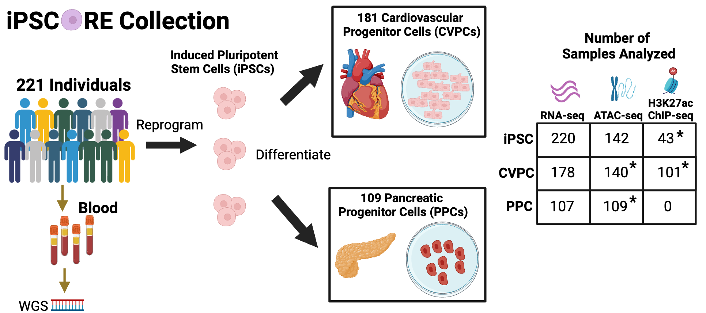

# iPSCORE Multi-QTL Resource

The iPSCORE collection was generated by the Frazer Lab with the goal of functionally characterizing regulatory variants that are associated with human complex traits and diseases. The collection contains multiple omics datasets from induced pluripotent stem cells (iPSC) and derived cardiovascular progenitor cells (CVPC) and pancreatic progenitor cells (PPC). This collection is unique because not only does it contain paired omics datasets from hundreds of samples but it enables molecular characterization of regulatory variation that are active during fetal development, a timepoint that is increasingly gaining interest due to its role in influencing traits and diseases later in life. 

We describe our findings from XXX using the scripts in this repository. 

Contact Information:
Timothy D. Arthur, tdarthur40@gmail.com
Jennifer P. Nguyen, jenniferngp001@gmail.com
Kelly A. Frazer (PI), kellyfrazer27@gmail.com

## Raw data processing
Contains scripts for processing raw data from:
1. ATAC-seq
2. ChIP-seq 
3. RNA-seq
   
## QTL Mapping
Contains scripts for:
1. Filtering WGS variants
2. Genotype PCA
3. Processing and quantile-normalization of RNA-seq and ATAC-seq
4. PEER optimization
5. QTL mapping and conditional analysis
6. P-value multiple correction

## Analysis
Contains code for all analyses conducted in the study
1. Epigenome Characterization 
2. Characterization of QTLs 
3. Fetal-specific eQTLs 
4. QTL Modules 
5. GWAS-QTL

## Figures and Source Data
Contains scripts for generating figures in the paper

## Supplemental Tables
Contains scripts for generating supplemental tables in the paper

## Previous iPSCORE Papers

