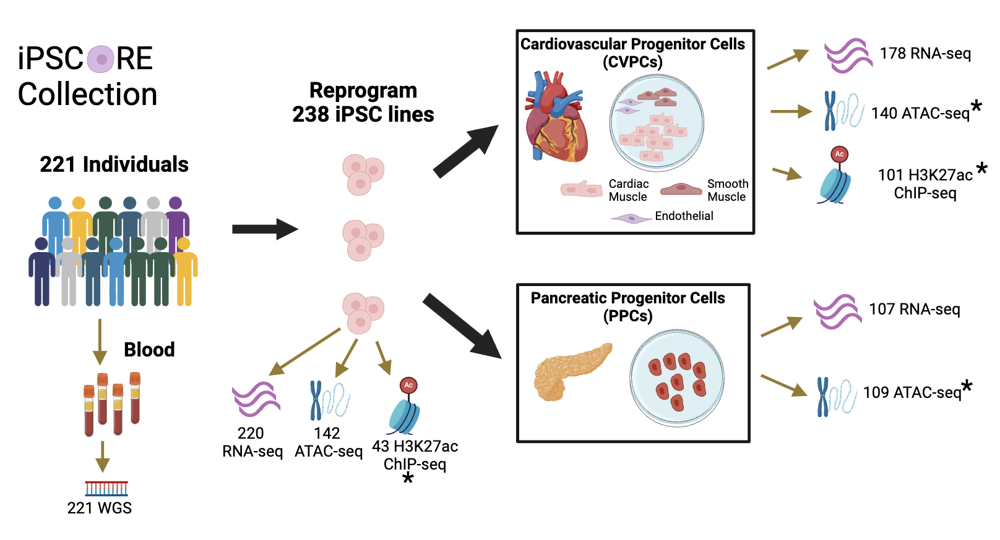

# iPSCORE Multi-QTL Resource

The iPSCORE collection was generated by the Frazer Lab with the goal of functionally characterizing regulatory variants that are associated with human complex traits and diseases. The collection contains multiple omics datasets from induced pluripotent stem cells (iPSC) and derived cardiovascular progenitor cells (CVPC) and pancreatic progenitor cells (PPC). This collection is unique because not only does it contain matched omics dataset from hundreds of samples but it enables molecular characterization of regulatory variation that are active during fetal development, a timepoint that is increasingly gaining interest due to its role in influencing traits and diseases later in life. 

We describe our findings using these datasets in a publication (PMID:X) using the scripts provided in this repository. 

Contact Information:
Timothy D. Arthur, tdarthur40@gmail.com
Jennifer P. Nguyen, jenniferngp001@gmail.com
Kelly A. Frazer (PI), kellyfrazer27@gmail.com

## Raw data processing
Contains scripts for processing raw data from:
1. ATAC-seq
2. ChIP-seq
3. RNA-seq
   
## Analysis
Contains code for all analyses conducted in the study
1. Characterization of ATAC-seq 
2. Characterization of ChIP-seq
3. LD Score Regression
4. Fetal-unique QTLs
5. QTL fine-mapping
6. QTL-QTL colocalization
7. QTL networks
8. GWAS-QTL colocalization
9. GWAS-QTL processing
10. GWAS independent loci

## QTL Mapping
Contains scripts for:
1. Filtering WGS variants
2. Genotype PCA
3. Processing and quantile-normalization of RNA-seq and ATAC-seq
4. PEER optimization
5. QTL mapping and conditional analysis
6. P-value multiple correction

## Figures
Contains scripts for generating figures in the paper

## Supplemental Tables
Contains scripts for generating supplemental tables in the paper

